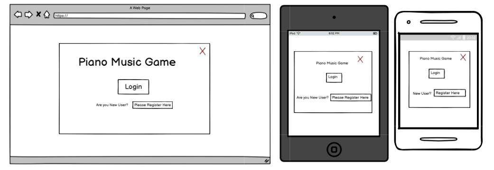

# sep-2024-hackathon-team-2

# sep-2024-hackathon-team-2

# Piano Music Game

Proudly present our retro game: Piano Music Game

[View Piano Music Game live link ](https://8000-erfannajimi-sep2024hack-vzxeqrnssjl.ws.codeinstitute-ide.net/)

# Overview

This game is designed to help users enhance their musical skills by listening to and replicating a short tune using an online piano interface. Users can track their progress over time, earn rewards, and compete on a leaderboard.

The game features a simple, fun, and engaging way to practice music, offering a gamified experience to encourage learning and progression.

Team Members:

- [Kelsey](https://github.com/kelseyjaneadams)
- [Mehtap](https://github.com/hisarciklilar)
- [Erfan] (https://github.com/ErfanNajimi)
- [Marlon](https://github.com/Markpm-code)
- [Noah](https://github.com/Noah-Samawi)
- [Liam](https://github.com/caleom)
- [Jab] ()

The goal is to provide users with a fun and interactive way to improve their musical skills, compete with others, and track their development through gamification.

---

## CONTENTS

* [User Experience](#user-experience-ux)
  * [User Stories](#user-stories)

* [Design](#design)
  * [Database](#Database)
  * [Colour Scheme](#colour-scheme)
  * [Typography](#typography)
  * [Imagery](#imagery)
  * [Wireframes](#wireframes)

* [Features](#features)
  * [General Features on Each Page](#general-features-on-each-page)
  * [Future Implementations](#future-implementations)
  * [Accessibility](#accessibility)

* [Technologies Used](#technologies-used)
  * [Languages Used](#languages-used)
  * [Frameworks, Libraries & Programs Used](#frameworks-libraries--programs-used)

* [Deployment & Local Development](#deployment--local-development)
  * [Deployment](#deployment)
  * [Local Development](#local-development)
    * [How to Fork](#how-to-fork)
    * [How to Clone](#how-to-clone)

* [Testing](#testing)

* [Credits](#credits)
  * [Code Used](#code-used)
  * [Content](#content)
  * [Media](#media)
  * [Acknowledgments](#acknowledgments)

---

## User Experience (UX)

### Initial Discussion

Replicate a Short Tune is a music game designed for players to listen to and replicate short tunes using an online instrument like a piano or drum. It offers an engaging way for users to practice music while tracking their progress and competing with others.

### User Stories

* As a player, I want to hear a randomly generated tune.
* As a player, I want to replicate the tune using an online piano.
* As a player, I want to receive immediate feedback on my performance.
* As a player, I want to track my score and see it on a leaderboard.
* As a player, I want to register and log in to save my progress.
* As a player, I want to earn badges or levels for my performance.

#### Client Goals

- Offer an engaging and fun music game.
- Create a learning environment where users can improve their musical skills.
- Include a persistent leaderboard and progress tracking.

#### First Time Visitor Goals

- To Understand the purpose of the game.
- Learn how to play and replicate tunes.
- Track progress and see scores on the leaderboard.

#### Returning Visitor Goals

- Beat my previous high score.
- View my progress and earned badges.
- Replay to improve my musical skills.

## Design

* We were following the original game design in terms of srt style.
* We were implementing new game mechanics. Shorter rounds and more birds at the same time.

### Database

* The database will track user scores, progress, tune data, and leaderboard rankings.
* Database model:

### Colour Scheme

The color scheme will be simple, clean, and focus on a modern interface with a musical touch.

### Imagery

The game's imagery will consist of modern piano graphics and simple notes. The UI will focus on providing a clear, intuitive interface to allow users to focus on replicating tunes.

### Wireframes

The wireframes provide a visual representation of the different pages and features of the app. They serve as a blueprint for the design and layout of each page, helping to visualize the user interface and overall user experience. These wireframes were created using Balsamiq, a tool that enables quick and intuitive sketching of design ideas.

Home / Login / Signup

  

User Page

  

Listen to the Tune

  

Listen to the Tune 2

  

Leaderboard

  

Leaderboard 2

  

#### Menu

#### Instructions

#### End Game

## Features

### General features

  - Main Menu: Access the game, view instructions, or check the leaderboard.
  - Game Interface: Listen to a short tune and replicate it using an online piano.
  - Feedback System: Receive real-time feedback based on your input (correct/incorrect).
  - Leaderboard: View the leaderboard with top scores globally.
  - User Profile: Track personal scores, earned badges, and progress.

### Future Implementations

- More Instruments: Add additional instruments (drums, guitar) for variety.
- Advanced Game Modes: Introduce levels of difficulty, such as "Expert Mode" with longer tunes.
- Collaborative Play: Allow users to play tunes together or compete in real-time.

### Accessibility

* Semantic HTML is used to ensure the game is accessible for screen readers.
* Keyboard Navigation will be available for users who prefer or require it.

## Technologies Used

HTML5, CSS, Javascript, Python, Django, 

### Languages Used

* HTML
* CSS
* JavaScript
* python

### Frameworks, Libraries & Programs Used

* [Balsamiq](https://www.balsamiq.com/wireframes/ "Balsamiq Wireframing Tool") was used to create the wireframes/sitemap for the site.
* [Tone.js](https://tonejs.github.io/) wUsed for sound generation and piano key sounds.
* [Gitpod](https://gitpod.io/ "cloud based IDE") was used for development.
* [Git](https://github.com/ "Version Control System") was used for developers to work on their own branch. Once approved changes would be merged into the main repository.
* [FireBase](https://https://firebase.google.com/ "Database") was used for our database.

## Deployment & Local Development

### Deployment

Deployed via GitHub Pages:

1. Log in to GitHub.
2. Navigate to the repository.
3. Go to Settings > Pages.
4. Choose main as the branch and /root for the folder.
5. Save and access the live link at the URL provided.

### Local Development

#### How to Fork

To fork the ErfanNajimi/sep-2024-hackathon-team-2 repository:

1. Log in (or sign up) to Github.
2. Go to the repository for this project, ErfanNajimi/sep-2024-hackathon-team-2.
3. Click the Fork button in the top right corner.

#### How to Clone

To clone the ErfanNajimi/sep-2024-hackathon-team-2:

1. Log in (or sign up) to GitHub.
2. Go to the repository for this project, ErfanNajimi/sep-2024-hackathon-team-2.
3. Click on the code button, select whether you would like to clone with HTTPS, SSH or GitHub CLI and copy the link shown.
4. Open the terminal in your code editor and change the current working directory to the location you want to use for the cloned directory.
5. Type 'git clone' into the terminal and then paste the link you copied in step 3. Press enter.

## Testing

* Manual Testing:

Game functionality and performance tested across devices.

* Bug Fixes:

- Bug 1: Gunshot sound not playing in the deployed version.
    1. [Step 1] Sound playback was inconsistent. Fixed by adjusting the sound buffer.
    2. [Step 2] Score not updating correctly. Fixed by ensuring score calculation after tune replication.

## Credits

- [Kelsey](https://github.com/kelseyjaneadams)
- [Mehtap](https://github.com/hisarciklilar)
- [Erfan] (https://github.com/ErfanNajimi)
- [Marlon](https://github.com/Markpm-code)
- [Noah](https://github.com/Noah-Samawi)
- [Liam](https://github.com/caleom)
- [Jab] ()

### Code Used

All the codes in this Repo was developed by us!

### Content

This content has been created by us - Retro Rascals -

###  Media

Every asset and sound in the project is , loyalty free, free to use for sommercial purposes.
  
###  Acknowledgments

Thanks to CodeInstitute for creating the Event!